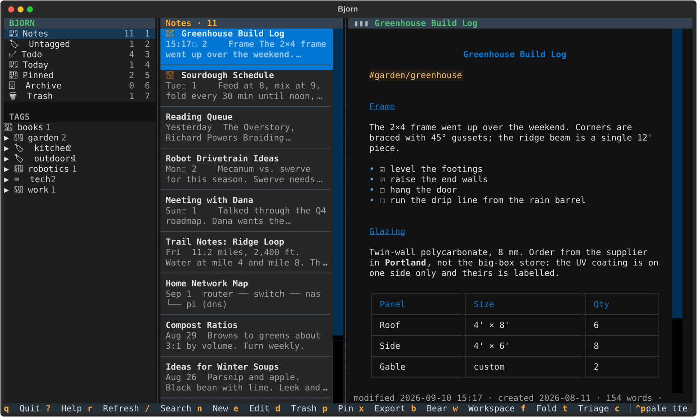
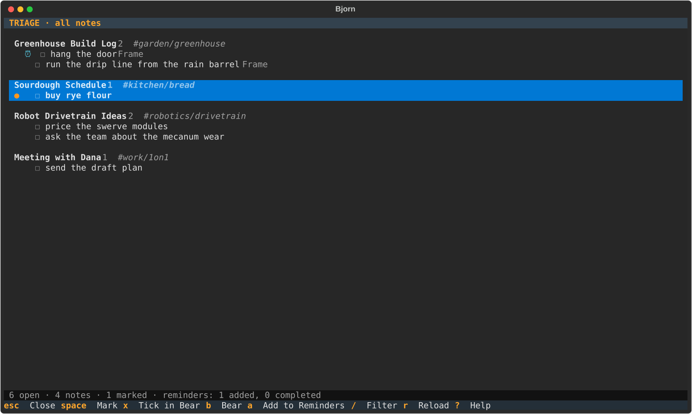

# Bjorn



A terminal front end for [Bear](https://bear.app), built with Python and
[Textual](https://textual.textualize.io). Three columns, like the app: smart
views and a nested tag tree on the left, the notes list in the middle, the
rendered note on the right. Everything goes through `bearcli`, the command
line tool that ships inside Bear.app, so Bjorn works with Bear open or closed
and never touches the database directly.

Editing is delegated to your editor (`$VISUAL`, then `$EDITOR`, then `vim`).
Writes back are hash-guarded: if the note changed in Bear while you were
editing, nothing is written and your version is kept in a temp file.

## Install

Requires macOS with Bear installed (Bjorn finds `bearcli` on `PATH` or inside
`/Applications/Bear.app`; set `bearcli = "..."` in the config for anywhere else),
Python 3.12+, and [uv](https://docs.astral.sh/uv/).

```sh
git clone https://github.com/7robots/bjorn.git
cd bjorn
./install.sh          # puts a `bjorn` launcher in ~/bin
bjorn                 # or: uv run bjorn
bjorn --tag work      # start scoped to a tag subtree
bjorn --demo          # sample notes through a built-in fake bearcli, no Bear needed
```

## Keys

| Key | Action | Key | Action |
|---|---|---|---|
| `tab` / `shift+tab` | cycle panes | `/` | search (Bear syntax); `@` and `#` complete, `→` accepts; `enter` runs it |
| `j` `k` `↑` `↓` | move within a pane; in the sidebar the cursor runs from the views into the tags; in the reader they scroll | `esc` | clear the search |
| `enter` | move into the reader for the highlighted note, at the first match while searching (clicking a note highlights it) | `1`–`7` | Notes, Untagged, Todo, Today, Pinned, Archive, Trash |
| `n` | new note (title, tags), then edit | `d` | move the note to the trash, after a confirm |
| `e` | edit in `$EDITOR` | `u` | restore from Trash or Archive |
| `p` | toggle the global pin | `x` | export: Markdown, HTML, text, RTF, TextBundle (`←` `→` or `h` `l` pick, `enter` confirms) |
| `b` | open in Bear.app | `w` | make the highlighted tag the workspace; again on it to leave |
| `f` | fold / unfold the highlighted tag's subtree | `W` | clear the workspace |
| `F` | fold every tag, or unfold them all when all are folded | `c` / click `▮▮▮` | hide the tag column, then the note column too, then show all three |
| `t` | triage the workspace's open todos | `r` | refresh now |
| `]` / `[` | next / previous match in the reader while searching | `?` | help (`esc` `q` `?` close it) |
| `q` | quit, after a confirm | | |

The **workspace** is a tag subtree that scopes the whole app: the tag tree
shows only it, the smart views count only inside it, search results are
filtered to it, and new notes default to it.

Search goes to `bearcli search` unchanged, so Bear's whole syntax works and
plain terms match body text, not just titles. While you type, `@` completes
bearcli's operators (`@todo`, `@title`, `@last7days`, `@date(`…) and `#`
completes your tags, workspace first, as ghost text that `→` accepts; a
one-line cheat sheet sits under the box. While a search is active the
reader highlights the terms, the header counts the matching blocks, `]` and `[`
step through them, and `enter` on a note lands on its first match. Fenced code
and tables are listed by Bear but not highlighted.

Views are computed from one `bearcli list` snapshot, so the counts in the
sidebar and the notes list always agree. **Pinned** means any pin, global or
inside a tag. **Today** means modified today, local time.

## Todo triage

`t` opens a screen listing every open `- [ ]` item from the `@todo` notes in
the workspace (all notes when none is set), grouped by note with the section
each item sits under. `space` marks rows, `x` ticks the marked (or highlighted)
items in Bear through `bearcli edit`, `enter` jumps to the note, `b` opens it
in Bear.app at that section, `/` filters, `r` reloads, `esc` or `q` closes.



With `[reminders] enabled = true` and [remctl](https://github.com/7robots/remctl)
on your PATH, `a` also pushes marked items to Apple Reminders. Each reminder's
notes carry the note's `bear://` link and a `bear-todo: <key>` line (the same
scheme remtui uses, so reminders it created are recognised); on every load
they are read back and rows show ⏰ for an open reminder or ✓ for one you
completed in Reminders, ready to `x` in Bear. Nothing is written into Bear when
a reminder is added.

## Configuration

`~/.config/bjorn/config.toml` (or `$XDG_CONFIG_HOME/bjorn/config.toml`). Every
key is optional:

```toml
editor = "nvim"               # overrides $VISUAL / $EDITOR
export_dir = "~/Downloads"    # where `x` proposes to write
export_format = "md"          # preselected in the export picker: md | html | txt | rtf | textbundle
poll_seconds = 5              # 0 disables the background refresh
workspace = "work"            # start scoped to this tag
bearcli = "/usr/local/bin/bearcli"  # optional; default searches PATH, then Bear.app
icon_style = "auto"           # auto | nerd | emoji | lucide | none
mouse_pixels = true           # set false in Tecolot / SwiftTerm terminals (see below)

[icons]                       # top-level tag -> Lucide icon name, or emoji:<glyph>
tech = "terminal"
school = "emoji:🎓"

[reminders]                   # triage can push todos to Apple Reminders
enabled = false               # off by default
list = "Bear"                 # target list; remctl's default when empty
due = "today"                 # due date for new reminders; "" for none
```

Top-level tags and the smart views carry icons: Nerd Font (Material Design)
glyphs when the terminal is Ghostty or WezTerm or a Nerd Font is installed,
emoji otherwise. Built-in defaults cover common top-level tags (`work`, `home`,
`projects`, `ideas`, `journal`, `books`, `tech`, `garden`, `travel`, `health`,
`music`, `robotics`, `school`); anything else gets a tag glyph. Names are Lucide's (`bot`, `book-open`, `compass`, ...); see
`src/bjorn/icons.py` for the table.

### Lucide icons directly

`icon_style = "lucide"` draws Lucide's own glyphs from its icon font instead of
Nerd Font look-alikes, and any of Lucide's 2,000+ names works under `[icons]`.
It is opt-in because the terminal has to be told about the font:

```sh
# 1. Install the font. Pin the version Bjorn's codepoint table was built from.
curl -L -o ~/Library/Fonts/lucide.ttf https://unpkg.com/lucide-static@1.43.0/font/lucide.ttf

# 2. Ghostty: route Lucide's codepoint range to it (~/.config/ghostty/config).
font-codepoint-map = U+E038-U+E768=Lucide
```

Open a new Ghostty window afterwards. Kitty's `symbol_map` does the same job.

Two caveats. Lucide reassigns codepoints between releases, so the installed
`lucide.ttf` must match the bundled table (lucide-static 1.43.0; both are noted
in `src/bjorn/icons.py`). And U+E000–U+E7FF is where Nerd Fonts keep the
Powerline, Pomicons, Seti and Codicons sets, so that mapping takes those glyphs
away from everything in the window: prompt themes, `eza`/`lsd` file icons,
Neovim statuslines. Bjorn's Material Design glyphs live above U+F0000 and are
unaffected.

The poll is cheap: two `bearcli list` probes run together (about 20 ms) and a
reload only when something changed. A reload lists metadata only and reads
the body of just the notes whose modification time moved, so on a couple of
thousand notes it takes about 0.6 s instead of the 1.8 s a full listing
with content costs; only the first snapshot pays that. The notes list
mounts rows in windows of 120 as you move through it.

### Mouse hover on the wrong row (Tecolot, SwiftTerm)

Textual switches to pixel-precise mouse reporting (mode 1016) when a terminal
supports in-band resize (mode 2048) and converts pixels to cells with the size
from that report. SwiftTerm-based terminals report the size in device pixels
but the mouse position in points, so on a Retina display the hover lands at
half the pointer's row. Until SwiftTerm fixes it, set `mouse_pixels = false` in
config or run `bjorn --no-mouse-pixels`: Bjorn then never asks about 2048 and
the mouse stays in cell mode. `tools/mouseprobe.py` shows the raw reports.

## Development

```sh
uv sync
uv run pytest          # the suite drives a fake bearcli as a real subprocess
uv run bjorn --demo
```

The plan and its status live in `docs/plans/bjorn-tui.md`; deferred work in
`docs/ROADMAP.md`. `uv run python tools/screenshot.py` regenerates the
screenshot above from an invented library through the fake bearcli.

## Acknowledgements

Bjorn exists because of [Shiny Frog](https://shinyfrog.net) and
[Bear](https://bear.app). Bear is the notes app Bjorn is a front end for, and
`bearcli`, the command line tool Shiny Frog ships inside Bear.app, is what
makes a terminal client possible at all: every listing, search, read, edit
and export in Bjorn is a `bearcli` call. Thank you for building it, and for
building it well.
